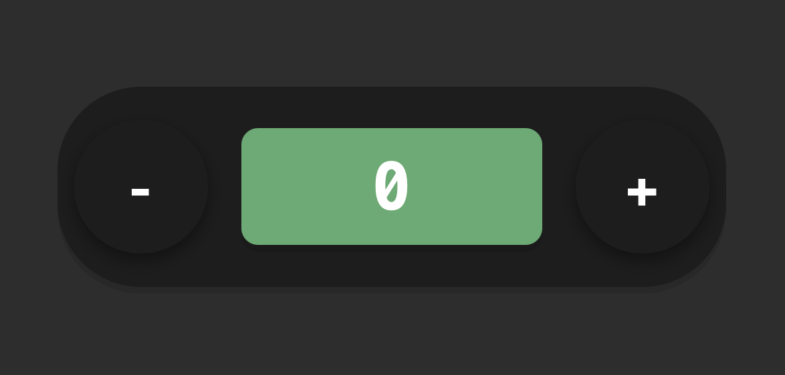

# 🧮 JavaScript Counter

A simple JavaScript counter application that allows users to increment and decrement a value using both mouse buttons and keyboard keys. This project was built without any frameworks, using only **JavaScript**, **HTML**, and **CSS**.

---

## 🚀 Live Demo

👉 [Try the app live on GitHub Pages](https://lucaf50.github.io/JS-counter/)

---

## 📸 Preview



---

## 📁 Project Structure

/
├── index.html
└── assets/
    ├── css/
    │   └── styles.css
    ├── js/
    │   └── script.js
    └── img/
        └── screenshot.png


---

## 🔧 Features

- Display a starting value of `0`
- Increment and decrement value with:
  - ➕ / ➖ buttons
  - `+` / `-` keys on the keyboard
- Fully built with DOM manipulation (no HTML buttons/h1 hardcoded)
- Minimal and clean retro-inspired styling
- Modular code structure for better readability

---

## 🛠️ Technologies Used

- HTML5
- CSS3
- JavaScript (ES6)

---

## 📦 How to Run Locally

1. Clone the repository:
   
   ```bash
   git clone https://github.com/lucaf50/JS-counter.git
   
2. Open the project folder:

   ```bash
   cd JS-counter
   
3. Open index.html in your browser.


